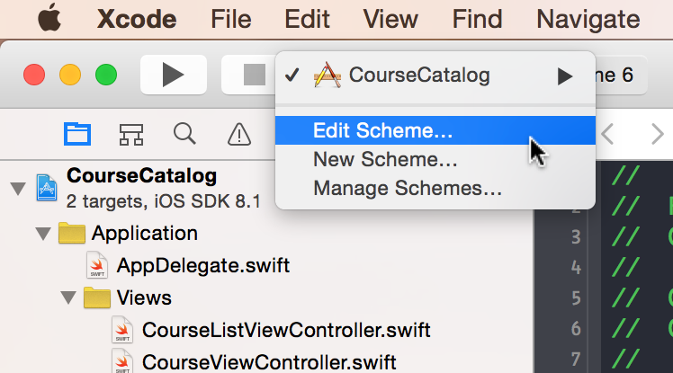
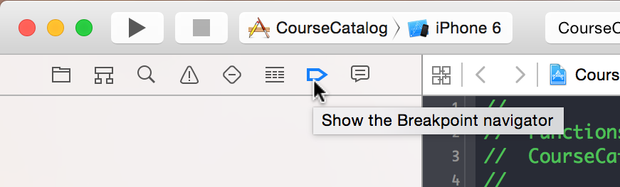
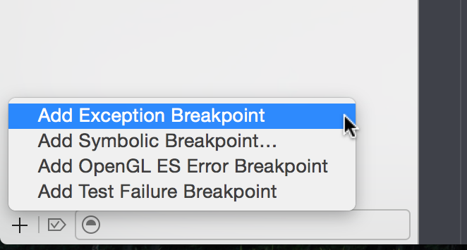
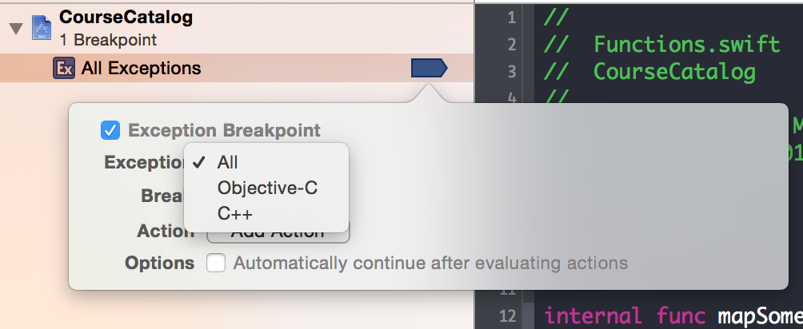

#307: Core Data Threading: Lab Instructions

Even though we've set up the project with multiple contexts, we're still not quite done implementing things correctly. It turns out, we're missing a few crucial calls that enable Core Data to properly protect access to data objects. It's likely to happen in your apps, so let's find out how to find and resolve the improper usage of the Core Data threading API.

### 1) Update Scheme Settings

In Xcode, in the toolbar, select the CourseCatalog project, and select Edit Scheme in the pop menu.

In the edit scheme dialog, select the **Arguments** tab.

Add a new **Argument Passed on Launch** by clicking the **+** button at the bottom. Enter the following as the complete argument value:

	-com.apple.CoreData.ConcurrencyDebug 1
	
In iOS7, the Core Data team introduced this flag to help developers find improper usages of Core Data threading support in their apps. Enabling concurrency debugging for Core Data causes your app to crash when a thread assertion has been hit inside the Core Data framework. That is, when you are improperly using the Core Data threading API, and Core Data is able to assert that improper usage, your app will crash. So, how is this 'feature' helpful? This crash isn't necessarily a crash, per se, but an assertion. And most assertions in Objective C and Core Data are thrown exceptions. That means you can simply catch all exceptions when debugging your application and the debugger will land in the exact spot where the problem is being caused. 

### 2) Add an Exception Breakpoint

Well, let's go ahead as make sure we're catching all exceptions in the debugger.

In Xcode, show the Breakpoint Navigator tab:

The keyboard shortcut key is Cmd + 7.

At the bottom, click on the **+** button, and select **Add Exception Breakpoint**

This should be enough to catch all exceptions that happen in your application. However you can limit the exceptions the debugger catches by right-clicking on the new Exception break point. Then select **Edit Breakpoint...**. In the Exceptions setting, select 'Objective-C'.

###3) Build and Run ... and Crash

Now, in this case, we're actually looking for crashes because of the Core Data concurrency debug flag.

Build and run the app. Press the Load Courses button. The app should crash, and Xcode should be pointing you to some assembly. First, you'll need to look up the debug stack, and look for the highest stack that refers to your code. This should be the place that has triggered Core Data to crash since it's not correctly using threads.

**In find, add**

	context.performBlockAndWait {
	}
	
The final piece of the puzzle in setting up Core Data to work with background 
        
**In create, add**

	context.performBlockAndWait {
	}
	
**In save, add**

	context.performBlock {
	}
	
**In adapt function, add**

	context.performBlockAndWait {
	}
	
And now you have an app that is performing its main data importing operations in the background. You're ready to start the challenges and getting your app to  display visual progress during import.